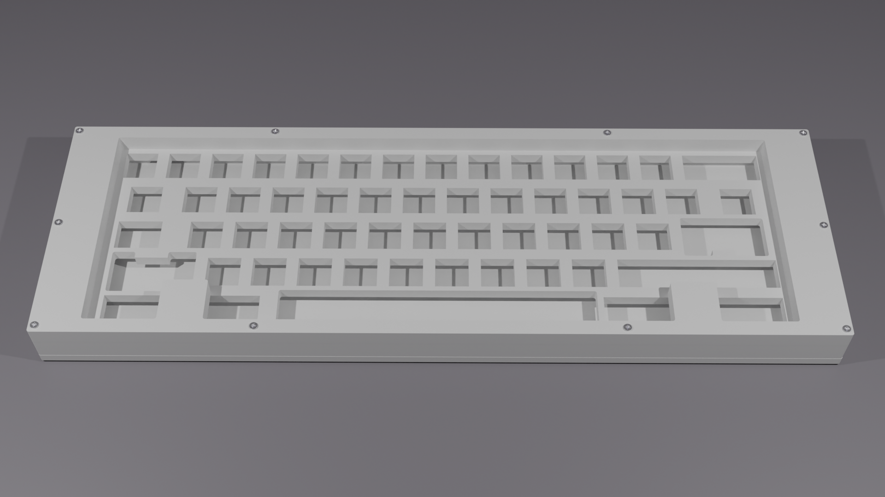
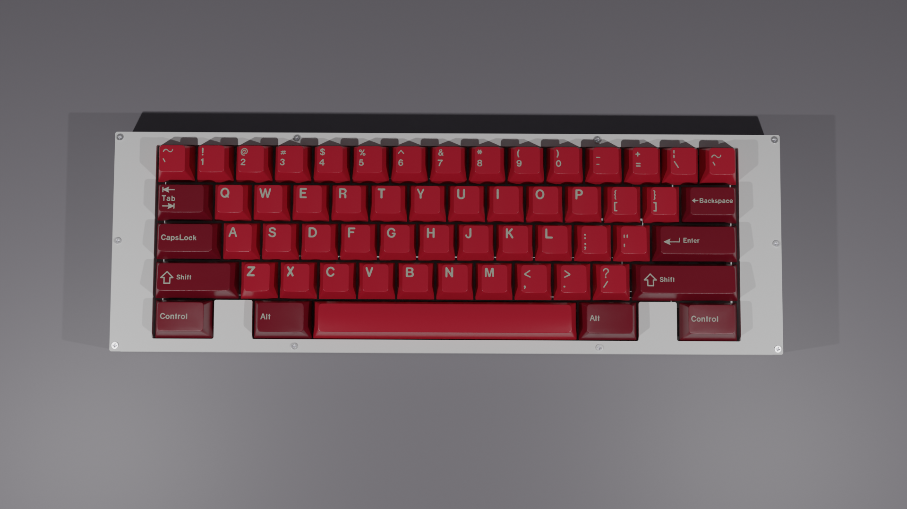
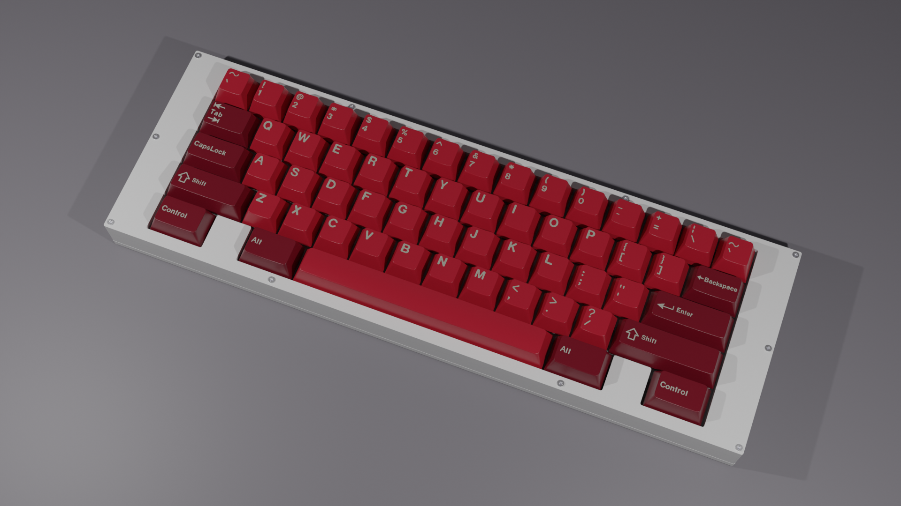

# IkCase-wkl

A Stacked Acrylic Case for WKL layout compatible with standard 60% PCBs

## Layout:

- **Top row**: The right corner can be a 2 1U keys (like the renders) or a 1 2U stab key.

- **Bottom row - Fixed Layout**: 1.5U left Control, 1.5U left Alt, 7U space bar, 1.5U right Alt, 1.5U right Control.

---

## Acrilic Layers

The case is made with 5 layers of acrylic that are stacked on top of each other and held together with 8 **M2** screws (screw holes are 2mm diameter).
Note that this case has been developed for a PCB that has the **USB underneath of the PCB**. This case **won't fit with a PCB that has the USB on top**.

- **L5**: The top piece of the case. The ideal thickness is 8mm (8 millimetres).

- **L4-plate-wkl**: This is the switchplate of the keyboard. Will hold the switches and the ideal thickness is 5mm (5 millimetres).

- **L1_L2_L3**: This piece is placed between the plate and the base piece to offer space to the PCB and the ideal thickness is 5mm (5 millimetres).

- **L0**: The bottom piece that closes the case. The ideal thickness is 4mm (4 millimetres). Like **L1_L2_L3** piece, has the USB port exit.

---

## Final Prototype

